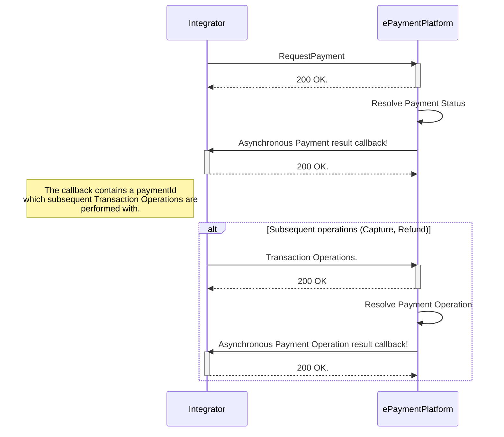

#


```
Welcome to the Getting Started guide for the BankAxept 
Epayment Platform (EPP).

This text is intended to give both clear descriptions and 
guidance for integrators and consumers of EPP. It includes an
overview of all critical features as well as some general
hints of how to utilize this platform.
```

# Introduction
EPaymentPlatform (EPP) is a Payment API for integrators (Integrator) utilizing BankAxept online payment. It is based on a core principle of asynchronous exchange of information where the transactions created can be identified using an EPP defined PaymentId and an Integrator defined MessageId. Traditional transaction operations can thereafter be performed as seen according to the `Operations` section.

# Payment flow

## Standard flow

Below is the Payment request's happy flow. Note that the PaymentId which
subsequent operations are performed with is contained in the asynchronous callback.




## Creating a payment
A full overview of all available fields for a payment can be found in the [Payments Request](https://github.com/BankAxept/bankaxept-epayment-development-kit/blob/main/openapi/integrator/merchant/bankaxept.yaml) component part our API spec.

### Creating a payment guidelines.

``messageId``: The ``messageId``field is considered the Integrator's unique identifier of a PaymentRequest, and can be used in the case of a [Rollback Request](https://github.com/BankAxept/bankaxept-epayment-development-kit/blob/main/openapi/integrator/merchant/bankaxept.yaml)
of an ongoing payment. The ePaymentPlatform performs duplicate controls on the ``messageId`` field and therefore it *must* be unique pr separate payment request. Meaning that if multiple are done for the same Order (for example a retry due to a previously failed payment request.), a new ``messageId`` must be used.

``merchantOrderReference``: The ``merchantOrderReference``field considered a reference to the Merchant's Order which might be distinct from the Integrator's own ``messageId``.

### Asynchronous retry policy
Any Asynchronous Requests will be retried if the Response from the Integrator is anything other than ``200 OK``.  

Retries will be performed first after 10 seconds, and thereafter with an exponential backoff for 24 hours. After 24 hours the retry attempts will stop.

The backoff will extend additionally at a rate of `1.5^X` seconds where X is the number of retries until a max retry interval of `10 minutes` is reached.

