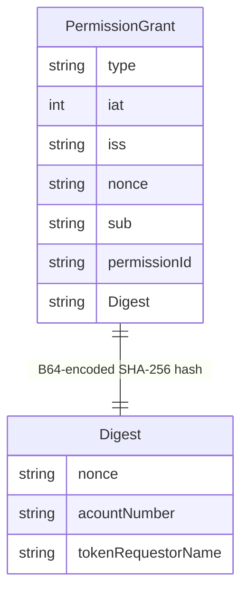
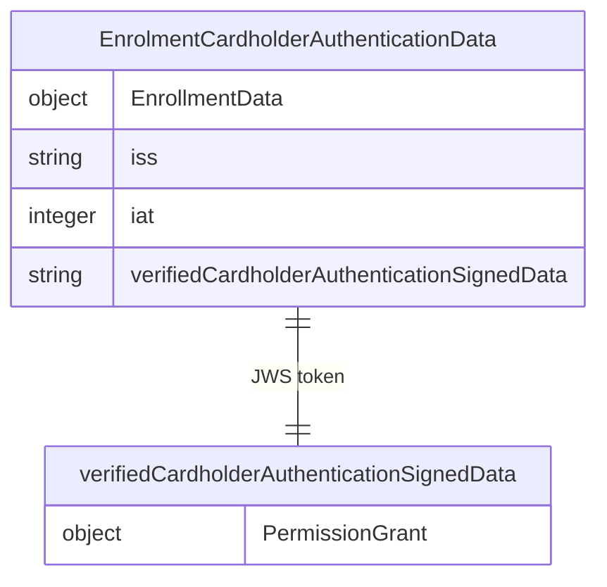
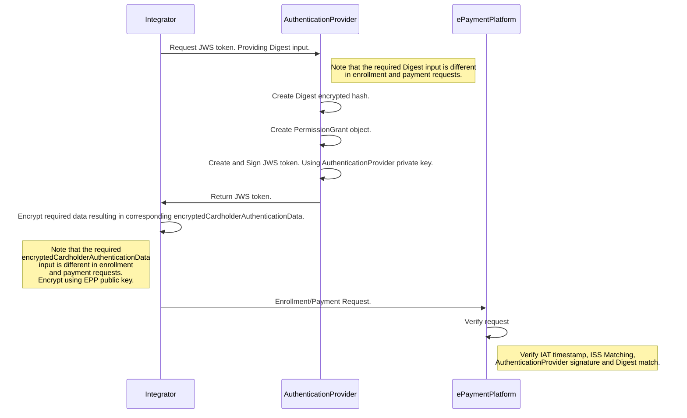

## Authentication Provider setup and guidelines
Every Integrator is required to provide an Authentication Provider that will be used to verify the authenticity of the payment request. This is done by
providing an encrypted


### Authentication Provider requirements.
In order to facilitate an authenticated payment the Authentication Provider must provide a signed JWS token that is verified by EPP.
This JWS needs to contain a `PermissionGrant` object that is encoded in the JWS token. It must have
the structure as seen in the [components overiew](assets/swagger/swagger_epp_components.md).

We recommend using a robust signing algorithm such as `RS256`.

The `Digest` field in the `PermissionGrant` object is a B64 encoded SHA-256 hash of the following datapoints.

For enrollment:
````
nonce: must be the same as the corresponding nonce in the PermissionGrant object.
AccountNumber: The Account Number of the enrollment session. 
TokenRequestorName: The Token Requestor Name ()
````

For payment:

````
nonce: must be the same as the corresponding nonce in the PermissionGrant object.
merchantReference : set by WalletProvider.
merchantDisplayName : set by WalletProvider.
amount : set by WalletProvider.
currency : set by WalletProvider.
````

### Wallet Provider requirements.
Any request must contain `encryptedCardholderAuthenticationData` which matches the `verifiedCardholderAuthenticationSignedData` object once decrypted.

The `verifiedCardholderAuthenticationSignedData` object must be encrypted using the provided public certificate from EPP as received in point 7 in [Setting up your EPP integration](#setting-up-your-epp-integration).
The `verifiedCardholderAuthenticationSignedData` object can be reviewed in our [components overiew](assets/swagger/swagger_epp_components.md).

The `ISS` field is received from EPP and acts as a correlation to the Authentication provider that was configured to your Profile.

A corresponding `Token Requestor Name` that represent the human-readable name of the token requestor will also be provided.
This needs to be encoded in the Authentication Provider's `PermissionGrant` object.

## Illustrated EPP-Wallet Provider-Authentication Provider interoperability.

First a PermissionGrant object is created. It's structure can be reviewed in the [components overiew](assets/swagger/swagger_epp_components.md).
This object is then encoded in a signed JWS token that is signed using the private key of the Authentication Provider. The signature is then validated in EPP.

Enrollment used as example, same fundamental structure applies for payment.


This is then encoded in a JWS token that is signed by the Authentication Provider's private key. The JWS token is then sent to EPP for validation as part of the Integrator's Payment/Enrollment request.


Enrollment used as example, same fundamental structure applies for payment.


This data object must then be encrypted using the public certificate provided by EPP.
This is then made a part of every enrollment/payment request towards EPP in the `encryptedCardholderAuthenticationData`.

This leads to the following sequence.


