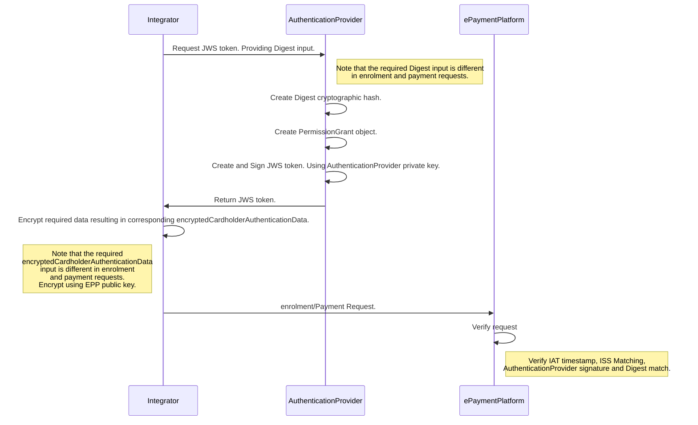
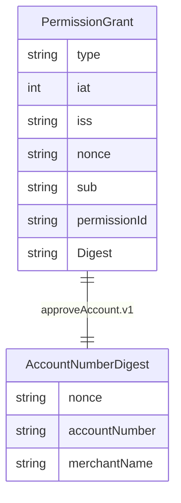
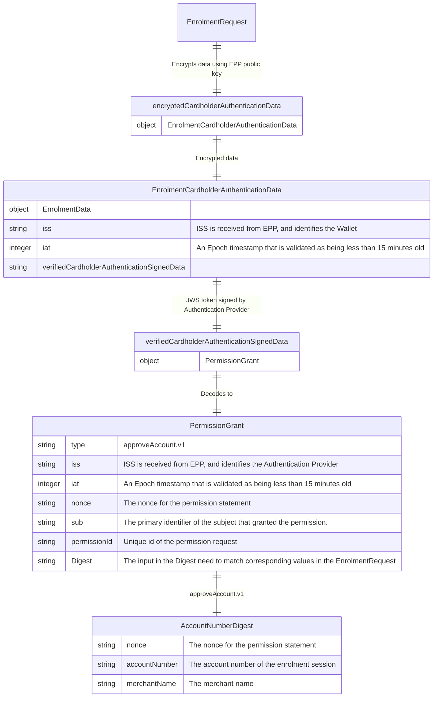
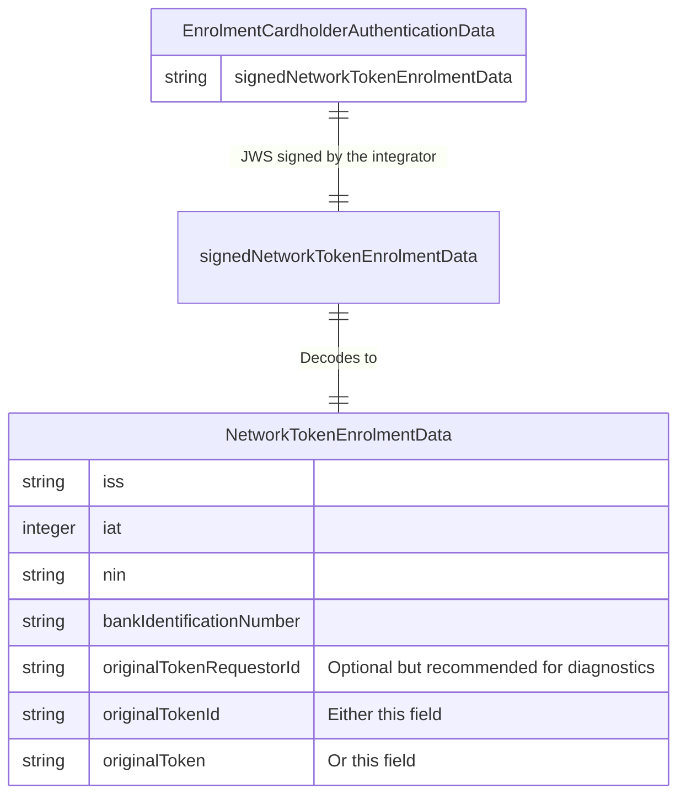
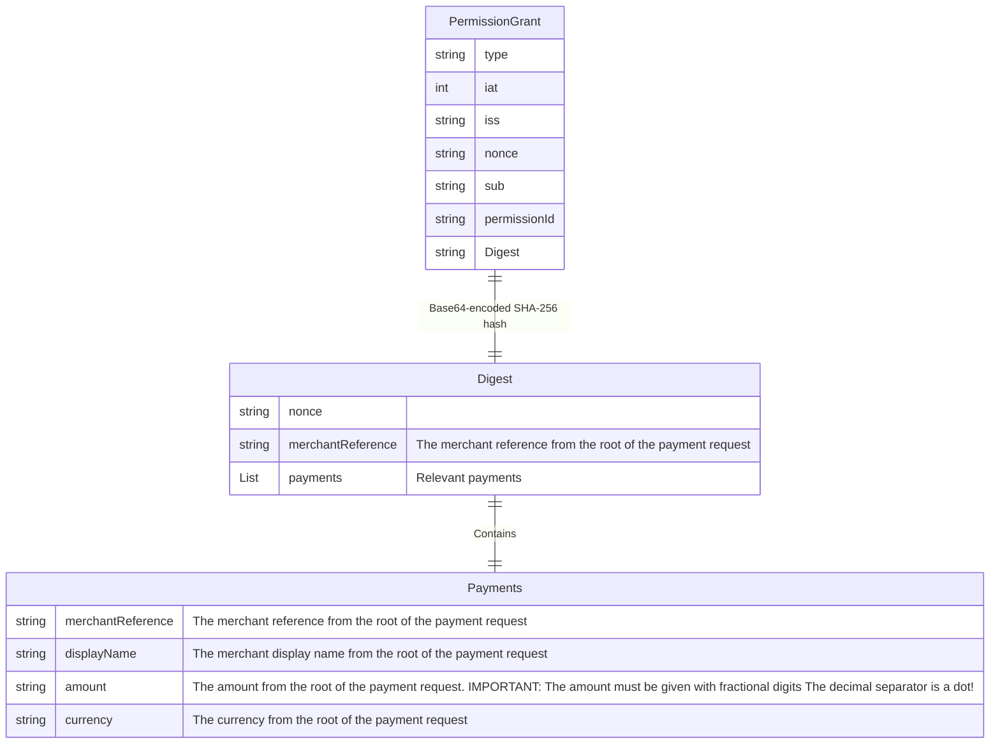
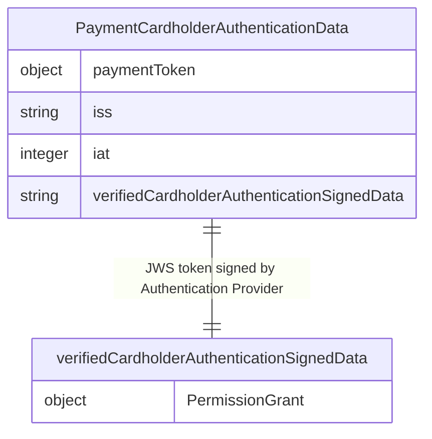
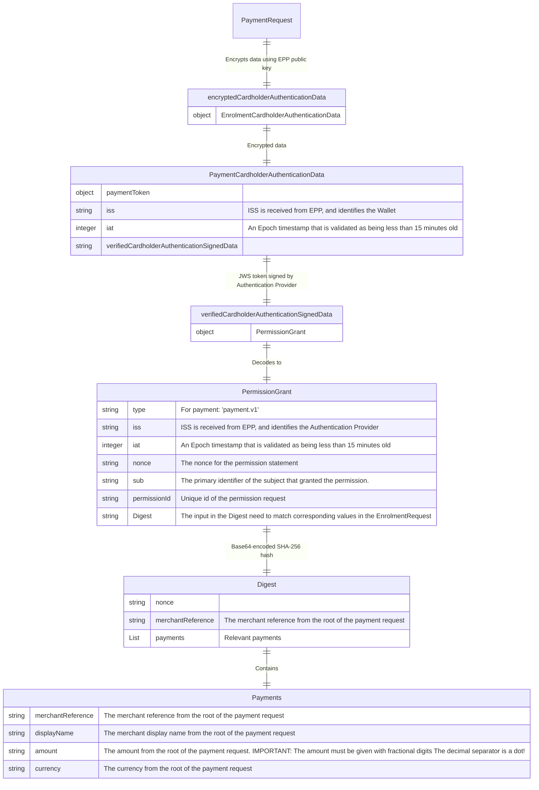

## Authentication Provider setup and guidelines

Every integrator must provide an Authentication Provider for account number enrolment and payment requests. These
requests contain an encrypted data object with data generated by the Authentication Provider. For network token
enrolment, the integrator signs `NetworkTokenEnrolmentData` directly.

### Authentication Provider requirements

To facilitate an authenticated payment, the Authentication Provider must provide a signed JWS token
verified by EPP.
This JWS needs to contain a `PermissionGrant` object that is encoded in the JWS token. It must have
the structure as seen in the [Components overview](./swagger/epp_components.md).

You must use a robust signing algorithm. We accept `ES256` or `PS256` as the signing algorithm.

The `digest` field in the `PermissionGrant` object is an unpadded, URL-safe Base64 encoded SHA-256 hash of a compact
UTF-8 JSON permission statement. Properties must appear in the order specified for the permission type, with no
insignificant whitespace.

#### For Account Number Enrolment

The `approveAccount.v1` permission statement contains these properties in order:

1. `nonce`: Must match the nonce in the `PermissionGrant` object.
2. `accountNumber`: The account number of the enrolment session.
3. `merchantName`: The merchant name provided during information exchange.

#### For Network Token Enrolment

The integrator creates `NetworkTokenEnrolmentData` containing `iss`, `iat`, `nin`, `bankIdentificationNumber`, and the
original token fields, then signs it with the integrator's private key as a compact JWS. Include the resulting value as
`signedNetworkTokenEnrolmentData` in `EnrolmentCardholderAuthenticationData`.

The Merchant Name is part of the information exchange as seen in our
[checklist](./getting_started.md#checklist-for-information-exchange).

#### For Payment

> nonce: Must be the same as the corresponding nonce in the PermissionGrant object.
>
> merchantReference: Set by Wallet.
>
> creditorName: Merchant display name. Set by Wallet.
>
> amount: Set by Wallet.
>
> currency: Set by Wallet.

#### Authentication field guidelines.

Some values from (./getting-started.md#checklist-for-information-exchange) must be used to create the DSCA digest
and
encrypted data object.

| Value                   | Usage                                                                                                                                                                       |
|-------------------------|-----------------------------------------------------------------------------------------------------------------------------------------------------------------------------|
| Merchant Name           | Used in account number enrolment for the `digest.merchantName` value.                                                                                                       |
| Encryption Issuer       | The Token Requestor ID assigned to the integrator. Use it as the outer `iss` for account number enrolment and payment, and as the signed `iss` for network token enrolment. |
| Permission Grant Issuer | The Authentication Provider ID. Use it as `PermissionGrant.iss` for account number enrolment and payment.                                                                   |

### Wallet requirements

Account number enrolment and payment requests contain `encryptedCardholderAuthenticationData` with
`verifiedCardholderAuthenticationSignedData` in the decrypted object. Network token enrolment contains
`signedNetworkTokenEnrolmentData` in the decrypted object.

Encrypt the complete cardholder authentication data object using the public certificate from EPP received in point 7
of [setting up your EPP integration](./getting_started.md#setting-up-your-epp-integration). The
`verifiedCardholderAuthenticationSignedData` object can be reviewed in our
[Components overview](./swagger/epp_components.md).

For account number enrolment and payment, the outer `iss` field is received from EPP and identifies the configured
integrator. For network token enrolment, include this value as `iss` inside the signed `NetworkTokenEnrolmentData`.

A corresponding `Merchant Name` will also be provided. This must be encoded as `merchantName` in the permission
statement used to calculate the digest.

## Illustrated EPP-Wallet-Authentication Provider interoperability

For account number enrolment and payment, the Permission Grant with corresponding Digest validation is based on
the [Open Banking Europe](https://www.openbankingeurope.eu/media/2096/obe-json-web-signature-profile-for-open-banking.pdf)
and [Berlin Group NextGen PSD2 guidelines](https://www.berlin-group.org/nextgenpsd2-downloads).
This ensures the integrity of the user's authentication and the account number enrolment or payment.

First a `PermissionGrant` object is created. Its structure can be reviewed in
the [Components overview](./swagger/epp_components.md).
This object is then encoded in a signed JWS token signed using the private key of the Authentication Provider.
The signature is then validated in EPP.

This leads to the following account number enrolment and payment sequence.
Note that in some scenarios, the Authentication Provider and the Integrator might
be the same organizational entity depending on your operating model.


```mermaid
sequenceDiagram
    participant Integrator
    participant AuthenticationProvider
    participant ePaymentPlatform
    Integrator ->> AuthenticationProvider: Request JWS token. Providing Digest input.
    note right of AuthenticationProvider: Note that the required Digest input is different <br/>in enrolment and payment requests.
    AuthenticationProvider ->> AuthenticationProvider: Create Digest cryptographic hash.
    AuthenticationProvider ->> AuthenticationProvider: Create PermissionGrant object.
    AuthenticationProvider ->> AuthenticationProvider: Create and Sign JWS token. Using AuthenticationProvider private key.
    AuthenticationProvider ->> Integrator: Return JWS token.
    Integrator ->> Integrator: Encrypt required data resulting in corresponding encryptedCardholderAuthenticationData.
    note left of Integrator: Note that the required <br/>encryptedCardholderAuthenticationData <br/> input is different in enrolment<br/> and payment requests. <br/> Encrypt using EPP public key.
    Integrator ->> ePaymentPlatform: enrolment/Payment Request.
    ePaymentPlatform ->> ePaymentPlatform: Verify request
    note right of ePaymentPlatform: Verify IAT timestamp, ISS Matching, <br/> AuthenticationProvider signature and Digest match.
```

### Enrolment example

The account number enrolment flow uses the following permission statement.


```mermaid
erDiagram
    PermissionGrant ||--|| AccountNumberDigest: "approveAccount.v1"
    PermissionGrant {
        string type
        int iat
        string iss
        string nonce
        string sub
        string permissionId
        string Digest
    }
    AccountNumberDigest {
        string nonce
        string accountNumber
        string merchantName
    }
```

This is then encoded in a JWS token signed by the Authentication Provider's private key.
The JWS token is then sent to EPP for validation as part of the Integrator's Payment/enrolment request.

Enrolment used as example, same fundamental structure applies for payment.


```mermaid
erDiagram
    EnrolmentCardholderAuthenticationData ||--|| verifiedCardholderAuthenticationSignedData: "JWS token signed by Authentication Provider"
    EnrolmentCardholderAuthenticationData {
        object enrolmentData
        string iss
        integer iat
        string verifiedCardholderAuthenticationSignedData
    }
    verifiedCardholderAuthenticationSignedData {
        object PermissionGrant
    }
```

This data object must then be encrypted using the public certificate provided by EPP.
For account number enrolment, include the result in `encryptedCardholderAuthenticationData`.

The combined data structure for a request can also be considered as seen below.
Enrolment used as an example, the same fundamental structure applies for payment.
The green color indicates Integrator, while the blue color indicates Authentication provider.


```mermaid
%%{init: {
  "theme": "default",
  "themeCSS": [
    ".er.relationshipLabel { fill: black; }", 
    ".er.relationshipLabelBox { fill: white; }", 
    ".er.entityBox { fill: lightgray; }",
    "[id^=entity-EnrolmentRequest] .er.entityBox { fill: lightgreen;} ",
    "[id^=entity-encryptedEnrolmentCardholderAuthenticationData] .er.entityBox { fill: lightgreen;} ",
    "[id^=entity-EnrolmentCardholderAuthenticationData] .er.entityBox { fill: lightgreen;} ",
    "[id^=entity-verifiedCardholderAuthenticationSignedData] .er.entityBox { fill: powderblue;} ",
    "[id^=entity-PermissionGrant] .er.entityBox { fill: powderblue;} ",
    "[id^=entity-Digest] .er.entityBox { fill: powderblue;} "
    ]
}}%%
erDiagram
    EnrolmentRequest ||--|| encryptedCardholderAuthenticationData: "Encrypts data using EPP public key"
    encryptedCardholderAuthenticationData {
        object EnrolmentCardholderAuthenticationData
    }
    encryptedCardholderAuthenticationData ||--|| EnrolmentCardholderAuthenticationData: "Encrypted data"
    EnrolmentCardholderAuthenticationData ||--|| verifiedCardholderAuthenticationSignedData: "JWS token signed by Authentication Provider"
    EnrolmentCardholderAuthenticationData {
        object EnrolmentData
        string iss "ISS is received from EPP, and identifies the Wallet"
        integer iat "An Epoch timestamp that is validated as being less than 15 minutes old"
        string verifiedCardholderAuthenticationSignedData
    }
    verifiedCardholderAuthenticationSignedData {
        object PermissionGrant
    }
    verifiedCardholderAuthenticationSignedData ||--|| PermissionGrant: "Decodes to"
    PermissionGrant ||--|| AccountNumberDigest: "approveAccount.v1"
    PermissionGrant {
        string type "approveAccount.v1"
        string iss "ISS is received from EPP, and identifies the Authentication Provider"
        integer iat "An Epoch timestamp that is validated as being less than 15 minutes old"
        string nonce "The nonce for the permission statement"
        string sub "The primary identifier of the subject that granted the permission."
        string permissionId "Unique id of the permission request"
        string Digest "The input in the Digest need to match corresponding values in the EnrolmentRequest"
    }
    AccountNumberDigest {
        string nonce "The nonce for the permission statement"
        string accountNumber "The account number of the enrolment session"
        string merchantName "The merchant name"
    }
```

For network token enrolment, the integrator signs `NetworkTokenEnrolmentData` directly. The compact JWS is included as
`signedNetworkTokenEnrolmentData` instead of `enrolmentData` and
`verifiedCardholderAuthenticationSignedData`.


```mermaid
erDiagram
    EnrolmentCardholderAuthenticationData ||--|| signedNetworkTokenEnrolmentData: "JWS signed by the integrator"
    signedNetworkTokenEnrolmentData ||--|| NetworkTokenEnrolmentData: "Decodes to"
    EnrolmentCardholderAuthenticationData {
        string signedNetworkTokenEnrolmentData
    }
    NetworkTokenEnrolmentData {
        string iss
        integer iat
        string nin
        string bankIdentificationNumber
        string originalTokenRequestorId "Optional but recommended for diagnostics"
        string originalTokenId "Either this field"
        string originalToken "Or this field"
    }
```

#### Payment example

Payment PermissionGrant.


```mermaid
erDiagram
    PermissionGrant ||--|| Digest: "Base64-encoded SHA-256 hash"
    PermissionGrant {
        string type
        int iat
        string iss
        string nonce
        string sub
        string permissionId
        string Digest
    }
    Digest {
        string nonce
        string merchantReference "The merchant reference from the root of the payment request"
        List payments "Relevant payments"
    }
    Digest ||--|| Payments: "Contains"
    Payments {
        string merchantReference "The merchant reference from the root of the payment request"
        string displayName "The merchant display name from the root of the payment request"
        string amount "The amount from the root of the payment request. IMPORTANT: The amount must be given with fractional digits The decimal separator is a dot!"
        string currency "The currency from the root of the payment request"
    }
```

**IMPORTANT NOTE**: The Amount must be given with fractional digits.
The decimal separator is a dot.
This is different from the Minor Units format in the root of the Payment Request.

EncryptedPaymentCardholderAuthenticationData should result in the following PaymentCardholderAuthenticationData object.


```mermaid
erDiagram
    PaymentCardholderAuthenticationData ||--|| verifiedCardholderAuthenticationSignedData: "JWS token signed by Authentication Provider"
    PaymentCardholderAuthenticationData {
        object paymentToken
        string iss
        integer iat
        string verifiedCardholderAuthenticationSignedData
    }
    verifiedCardholderAuthenticationSignedData {
        object PermissionGrant
    }
```

This data object must then be encrypted using the public certificate provided by EPP.
For payment, include the result in `encryptedCardholderAuthenticationData`.

The combined data structure for a request can also be considered as seen below.
The green color indicates Integrator, while the blue color indicates Authentication provider.


```mermaid
%%{init: {
  "theme": "default",
  "themeCSS": [
    ".er.relationshipLabel { fill: black; }", 
    ".er.relationshipLabelBox { fill: white; }", 
    ".er.entityBox { fill: lightgray; }",
    "[id^=entity-PaymentRequest] .er.entityBox { fill: lightgreen;} ",
    "[id^=entity-encryptedEnrolmentCardholderAuthenticationData] .er.entityBox { fill: lightgreen;} ",
    "[id^=entity-EnrolmentCardholderAuthenticationData] .er.entityBox { fill: lightgreen;} ",
    "[id^=entity-verifiedCardholderAuthenticationSignedData] .er.entityBox { fill: powderblue;} ",
    "[id^=entity-PermissionGrant] .er.entityBox { fill: powderblue;} ",
    "[id^=entity-Digest] .er.entityBox { fill: powderblue;} "
    ]
}}%%
erDiagram
    PaymentRequest ||--|| encryptedCardholderAuthenticationData: "Encrypts data using EPP public key"
    encryptedCardholderAuthenticationData {
        object EnrolmentCardholderAuthenticationData
    }
    encryptedCardholderAuthenticationData ||--|| PaymentCardholderAuthenticationData: "Encrypted data"
    PaymentCardholderAuthenticationData ||--|| verifiedCardholderAuthenticationSignedData: "JWS token signed by Authentication Provider"
    PaymentCardholderAuthenticationData {
        object paymentToken
        string iss "ISS is received from EPP, and identifies the Wallet"
        integer iat "An Epoch timestamp that is validated as being less than 15 minutes old"
        string verifiedCardholderAuthenticationSignedData
    }
    verifiedCardholderAuthenticationSignedData {
        object PermissionGrant
    }
    verifiedCardholderAuthenticationSignedData ||--|| PermissionGrant: "Decodes to"
    PermissionGrant ||--|| Digest: "Base64-encoded SHA-256 hash"
    PermissionGrant {
        string type "For payment: 'payment.v1'"
        string iss "ISS is received from EPP, and identifies the Authentication Provider"
        integer iat "An Epoch timestamp that is validated as being less than 15 minutes old"
        string nonce "The nonce for the permission statement"
        string sub "The primary identifier of the subject that granted the permission."
        string permissionId "Unique id of the permission request"
        string Digest "The input in the Digest need to match corresponding values in the EnrolmentRequest"
    }
    Digest {
        string nonce
        string merchantReference "The merchant reference from the root of the payment request"
        List payments "Relevant payments"
    }
    Digest ||--|| Payments: "Contains"
    Payments {
        string merchantReference "The merchant reference from the root of the payment request"
        string displayName "The merchant display name from the root of the payment request"
        string amount "The amount from the root of the payment request. IMPORTANT: The amount must be given with fractional digits The decimal separator is a dot!"
        string currency "The currency from the root of the payment request"
    }
```

## Digest validation examples

While the exact implementation may vary per Integrator/Coding language, the resulting digest logic must match the
following result

#### Bash example Payment

```bash
echo -n '{"nonce":"550e8400-e29b-41d4-a716-446655440000","id":"merchantReference","payments":[{"paymentId":"merchantReference","amount":"100","currency":"NOK","creditorName":"merchantDisplayName"}]}' \
| sha256sum - \
| awk '{print $1}' \
| xxd -r -p \
| base64 \
| tr -d '=' \
| tr '/+' '_-'
```

Script explanation: A SHA-256 hash is created from the JSON object. The resulting hash is then converted to binary and
encoded as a Base64 string. First `tr` is used to remove padding. Then `tr` is used to make the Base64 URL safe.

The script above should produce the following output:

`QomjM9YUvFcj0bd0Xjr39uMTaKzb1D54H_YAbHicy4Q`

You may use this to verify your own implementation.

#### Account Number Enrolment Digest

The compact JSON input for `approveAccount.v1` is:

```json
{"nonce":"a05b53be-718e-4df2-80ac-83696b711111","accountNumber":"12341212345","merchantName":"test-enrolment-name"}
```

The resulting digest is:

`-PAwASn3A47p15X48mrqBL-pWdcKtktj8bqTYCW0yn4`

#### Java example for Payment

```java

record PaymentPermissionStatement(
        String nonce,
        String id,
        List<PaymentPermissionStatement.Payment> payments
) {

    record Payment(
            String paymentId,
            String amount,
            String currency,
            String creditorName
    ) {
    }

    String digest() throws NoSuchAlgorithmException, JsonProcessingException {
        return Base64.getUrlEncoder()
                .withoutPadding()
                .encodeToString(MessageDigest.getInstance("SHA-256").digest(new ObjectMapper().writeValueAsBytes(this)));
    }

}
```

Follow by

```java
    new PaymentPermissionStatement(
        "550e8400-e29b-41d4-a716-446655440000",
                "merchantReference",
        List.of(new Payment(
                "merchantReference",
                "100.50",
                "NOK",
                "merchantDisplayName"
))).

digest();
```
