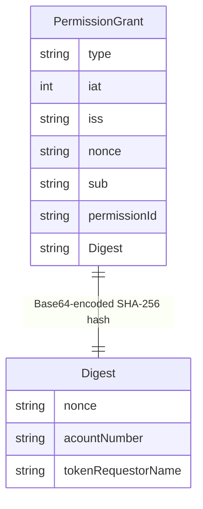
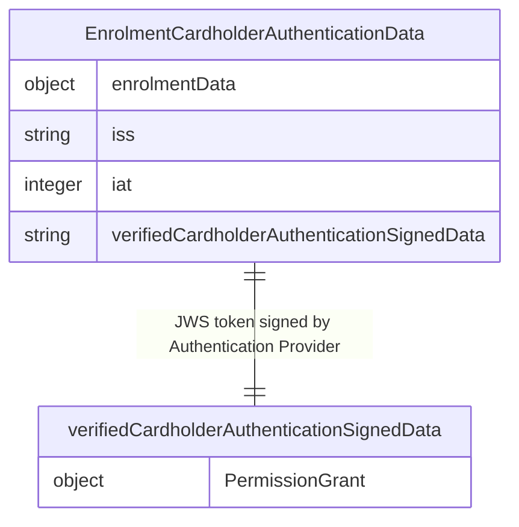
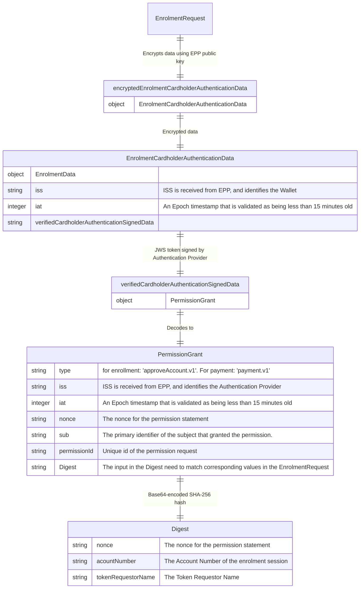

## Authentication Provider setup and guidelines
Every Integrator is required to provide an Authentication Provider that will be used to verify the authenticity of the payment request. This is done by
providing an encrypted data object in any enrolment/payment request that contains data generated by the Authentication Provider.

### Authentication Provider requirements
In order to facilitate an authenticated payment the Authentication Provider must provide a signed JWS token that is verified by EPP.
This JWS needs to contain a `PermissionGrant` object that is encoded in the JWS token. It must have
the structure as seen in the [components overiew](./swagger/epp_components.md).

We recommend using a robust signing algorithm such as `RS256`.

The `Digest` field in the `PermissionGrant` object is a `Base64` encoded SHA-256 hash of the following datapoints.

#### For enrolment:

> nonce: Must be the same as the corresponding nonce in the PermissionGrant object.
> 
> accountNumber: The Account Number of the enrolment session.
> 
> tokenRequestorName: The Token Requestor Name


The Token Requestor Name is part of the information exchange as seen in our [checklist](./getting_started.md#checklist-for-information-exchange).

#### For payment:


> nonce: Must be the same as the corresponding nonce in the PermissionGrant object.
> 
> merchantReference: Set by Wallet.
> 
> merchantDisplayName: Set by Wallet.
> 
> amount: Set by Wallet.
> 
> currency: Set by Wallet.


### Wallet requirements
Any request must contain `encryptedCardholderAuthenticationData` which matches the `verifiedCardholderAuthenticationSignedData` object once decrypted.

The `verifiedCardholderAuthenticationSignedData` object must be encrypted using the provided public certificate from EPP as received in point 7 in [setting up your EPP integration](./getting_started.md#setting-up-your-epp-integration).
The `verifiedCardholderAuthenticationSignedData` object can be reviewed in our [components overiew](./swagger/epp_components.md).

The `ISS` field is received from EPP and acts as a correlation to the Authentication provider that was configured to your Profile.

A corresponding `Token Requestor Name` that represent the human-readable name of the token requestor will also be provided.
This needs to be encoded in the Authentication Provider's `PermissionGrant` object.

## Illustrated EPP-Wallet-Authentication Provider interoperability

The Permission Grant with corresponding Digest validation is based on the [Open Banking Europe](https://www.openbankingeurope.eu/media/2096/obe-json-web-signature-profile-for-open-banking.pdf) and [Berlin Group NextGen PSD2 guidelines](https://www.berlin-group.org/nextgenpsd2-downloads) guidelines. This ensures the integrity
of the user's authentication and the enrolment/payment.

First a `PermissionGrant` object is created. Its structure can be reviewed in the [components overiew](./swagger/epp_components.md).
This object is then encoded in a signed JWS token that is signed using the private key of the Authentication Provider. The signature is then validated in EPP.

Enrolment used as example, same fundamental structure applies for payment.


This is then encoded in a JWS token that is signed by the Authentication Provider's private key. The JWS token is then sent to EPP for validation as part of the Integrator's Payment/enrolment request.

Enrolment used as example, same fundamental structure applies for payment.


This data object must then be encrypted using the public certificate provided by EPP.
This is then made a part of every enrolment/payment request towards EPP in the `encryptedCardholderAuthenticationData`.

This leads to the following sequence.


The combined data structure for a request can also be considered as seen below. Enrolment used as example, same fundamental structure applies for payment. 
The green color indicates Integrator, while the blue color indicates Authentication provider.




### Digest validaiton

While the exact implementation may vary per Integrator/Coding language the resulting digest logic must match the following result

```bash
echo -n '{"nonce":"550e8400-e29b-41d4-a716-446655440000","id":"merchantReference","payments":[{"paymentId":"merchantReference","amount":"100","currency":"NOK","creditorName":"merchantDisplayName"}]}' \
| sha256sum - \
| awk '{print $1}' \
| xxd -r -p \
| base64 \
| tr -d '=' \
| tr '/+' '_-'
```

Script explanation: A SHA-256 hash is created from the JSON object. The resulting hash is then converted to binary and encoded as a Base64 string. The `tr` command is used to remove the padding characters `=` and replace the characters `/` and `+` with `_` and `-` respectively.
