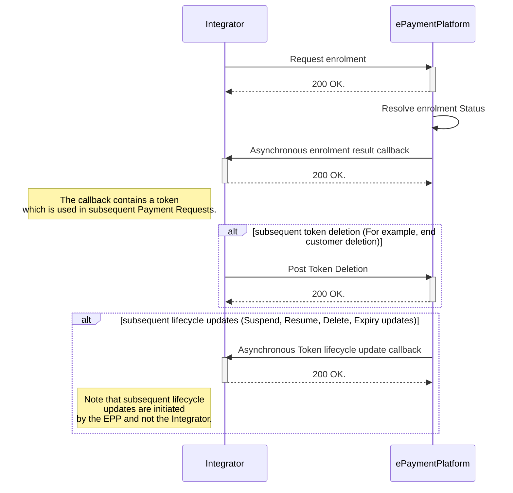
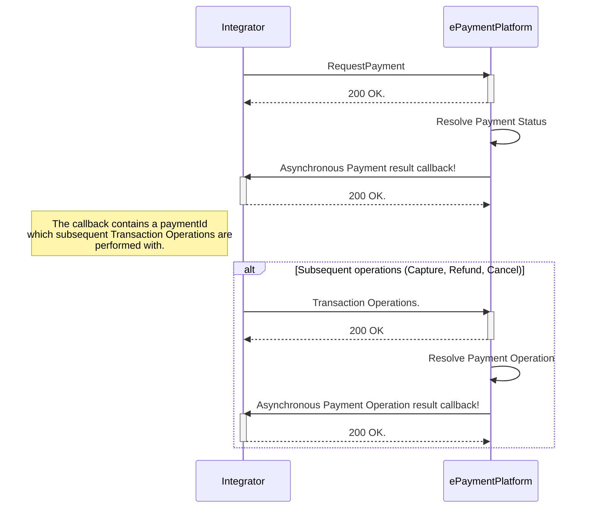

## Enroling a card

In order to perform a payment, a card needs to be enroled and tokenized first. First you must gather the necessary
information to perform an enrolment. This data is then sent to the ePayment Platform for tokenization.
The account number and NIN is used to identify the card that is to be tokenized. The EPP will then asynchronously send a
callback to the Integrator's Callback Server with the result of the enrolment, as well as any lifecycle changes from the
issuer. Your Callback Server must comply with our
[Integration Specification](./swagger/integrator_token_requestor_bankaxept.md).

The resulting Payment Token is then used as a reference to the account in subsequent payment requests.

In the case of an end customer revoking/deleting their payment source in the wallet a request should be sent to the
ePayment Platform to delete the token.

### Eligible banks.

In order to verify if a bank account is eligible for enrolment you might send a 4 digit bank identifier to
our [Eligible-Banks endpoint](https://epayment.bankaxept.no/swagger/integrator_token_requestor_bankaxept/). Where the
bank identifier is the first 4 digits of the bank account number.

This might be sent as an array of bank identifiers to verify multiple banks accounts at once.

As a synchronous response you will get all the bank identifiers in your request that are eligible for enrolment.

While the list of eligible banks is being constantly updated a 1 hour cache or similar is recommended to avoid
unnecessary calls. Evaluate as needed pr your system.

### Tokenization

The tokenization request must include a `tokenRequestorReference`. It acts as a reference set by the Token Requestor to
uniquely identify an enrolment request.
EPP uses this reference in all communication with the token requestor about the enrolment status. It is recommended that
a unique value per enrolment is used. However, it is not a requirement.

### Token lifecycle

As updates occur with the underlying payment source EPP will send updates according to
our [Token Requestor Callback API](./swagger/integrator_token_requestor_callback.md) specification.

| Lifecyle update(s) | Description                                                                            |
|--------------------|----------------------------------------------------------------------------------------|
| Suspensions        | An update notifying of a token suspension, should not be implemented as a final state. |
| Resumptions        | An update notifying of a token resumption, the token may be used again for payments.   |
| Deletions          | The token should be considered deleted and not used again.                             |
| Expiry updates     | An update extending the expiry of a token.                                             |

### Enrolment Standard flow

## Creating a payment

A full overview of all available fields for a payment can be found in
the [Payments Request](./swagger/integrator_merchant_bankaxept.md) component part our API spec.

### Payment Standard flow

Below is the Payment request's happy flow. Note that the PaymentId which
subsequent operations are performed with is contained in the asynchronous callback.

### Creating a payment guidelines

`messageId`: The `messageId`field is considered the Integrator's unique identifier of a PaymentRequest, and can be used
in the case of a [Rollback Request](./swagger/integrator_merchant_bankaxept.md).
of an ongoing payment. The ePaymentPlatform performs duplicate controls on the `messageId` field, and acts idempotent on
requests with the same `messageId`. Therefore, it *must* be unique pr separate payment request. Meaning that if multiple
are done for the same Order (for example a retry due to a previously failed payment request.), a new `messageId` must be
used.

`merchantOrderReference`: The `merchantOrderReference`field is considered a reference to the Merchant's Order which
might be distinct from the Integrator's own `messageId`.

#### Amount based test scenarios

When the payment request is sent with amounts between 1.00 and 1.99, then custom response codes will be triggered
according to the NISOK specification. This only affects the test environment.
Therefore, this range should only be used for intended testing purposes.

### Connection to enrolment and payment

Regardless of how you choose to implement the connection between the enrolment and payment, either using a third party
vendor or doing it all inside a single entity the `paymentToken` field
must have the **exact** same values as the `paymentToken` field in the enrolment callback for PSN and PAN.
As well as the same NNIN as used in Enrolment in the`PermissionGrant.sub` field which has the `nnin:123456789` format.

### Merchant name guidelines

In order to comply with our message format constraints `merchantDisplayName` must be matching the constraints specified
in our [API specification](./swagger/integrator_merchant_bankaxept.md).

In addition when you are operating as a Super Merchant (given that you are permitted thusly as part of your
configuration) you must include `superMerchantIdentifier*` where `superMerchantIdentifier`
is a unique identifier for the Super Merchant.
For example: `$walletName*$merchantName`.
The value should be the same as used in other equivalent setups.

### Callbacks

As an integrator processing payments you must integrate
the [Payment Callback API](./swagger/integrator_partner_bankaxept.md) to receive asynchronous updates on the status of
your payments.

## Settlement and Cutoff

To create a Settlement you must send a [Cutoff request](./swagger/integrator_merchant_bankaxept.md).
The Cutoff request must contain a `merchantId` and `batchNumber` which will trigger a settlement for all transactions
tied to the corresponding `batchNumber`.
The `batchNumber` is tied to a payment request and is returned in the asynchronous callback to the Integrator's Callback
Server once a payment is successfully processed.
In the case of an error or timeout (for example due to a network issue), the request may be retried.

Once a Cutoff request is received the `batchNumber` will increase and the new value will be used for all the subsequent
payments until the next cutoff, at which point the `batchNumber` will increase again.

We recommend settling pr merchant once a day.

Once a Settlement is successfully created the ePaymentPlatform will asynchronously send a callback to the Integrator's
Callback Server with the result of the Settlement.

## After the payment request

After the payment request has resolved with the asynchronous confirmation callback, the Integrator can perform the
following operations:
Note that all operations require both a `paymentId` and a unique `messageId` to be performed.

### Rollback

By utilizing the rollback request the Integrator can cancel an ongoing payment. The `messageId` field is used to
identify the payment to be rolled back.

General guidelines on when to rollback a payment:

* The Payment Request has been sent to the ePaymentPlatform but the Integrator has had technical issues receiving the
  callback *and* the Integrator believes it would be in the end customer's best interest to rollback the payment.
* The Payment Request has been sent but a `5xx`is received from the ePaymentPlatform.

### Cancellation

When you want to release any remaining un-captured funds related the transaction. This might be because:

* The Payment Request has been sent and successfully been processed, but for whatever reason the goods or services are
  not delivered to the end customer as expected.

### Capture

Must be performed 7 days within the Payment Request. The `paymentId` is used to identify the payment to be captured.
Where 7 days is defined as `7*24 hours` from the time the Payment Request was sent.
May be performed with a partial amount.

> Note that in the case of a Payment Request being sent with `autoCapture` set to `true` the EPP will perform a Capture
> operation to finalize the payment immediately.

### Refund

May only be performed with an amount lower than or equal to the previously captured amount.
The standard support is that a refund must be performed within 30 days, though this may vary based on your agreement
with BankAxept.

#### Rollback of refund

A refund that requires a rollback `must` be roll-backed within 1 day (24 hours) and for the full amount of the performed
refund. 
