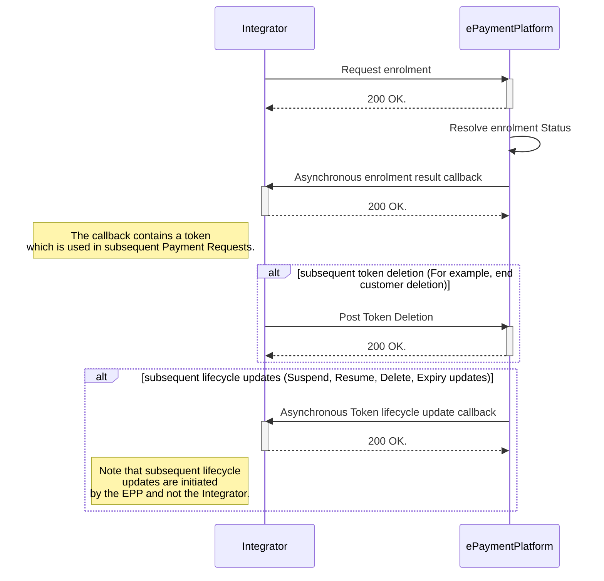
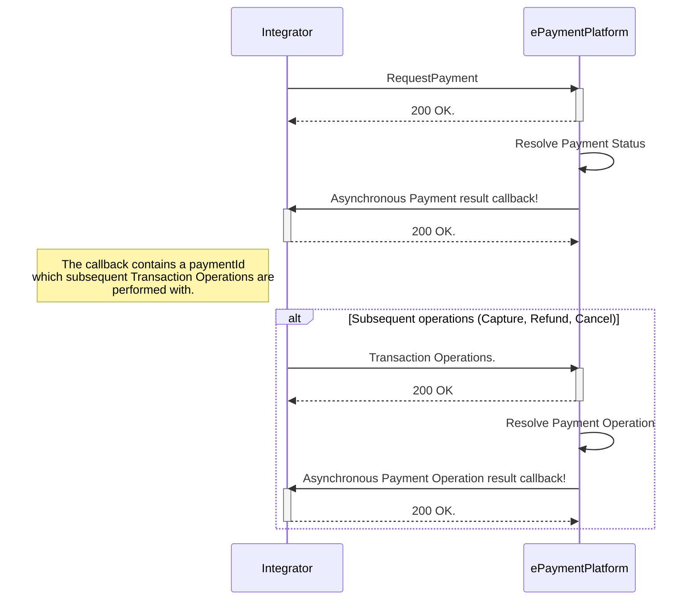

## Enroling a card

In order to perform a payment, a card needs to be enroled and tokenised first. First you must gather the necessary information to perform an enrolment. This data is then sent to the ePayment Platform for tokenization.
The account number and NIN is used to identify the card that is to be tokenized. The EPP will then asynchronously send a callback to the Integrator's Callback Server with the result of the enrolment, as well as any lifecycle changes.

The resulting Payment Token is then used as a reference to the account in subsequent payment requests.

In the case of a end customer revoking/deleting their payment source a request should be sent to the ePayment Platform to delete the token.

### Tokenization

Once you have requested a token you should expect the asynchronous call to your Callback Server. Your Callback Server must comply with our
[Integration Specification](/assets/swagger/swagger_integrator_token_requestor_bankaxept/).

The tokenization request must include a `tokenRequestorReference`. It acts as a reference set by the Token Requestor to uniquely identify an enrolment request. 
EPP uses this reference in all communication with the token requestor about the enrolment status. It is recommended that a unique value per enrolment is used. However, it is not a requirement.

### Token lifecycle

As updates occur with the underlying payment source EPP will send updates according to our [Token Requestor Callback API](/assets/swagger/swagger_integrator_token_requestor_callback/) specification.

| Lifecyle update(s) | Description                                                                            |
|--------------------|----------------------------------------------------------------------------------------|
| Suspensions        | An update notifying of a token suspension, should not be implemented as a final state. |
| Resumptions        | An update notifying of a token resumption, the token may be used again for payments.   |
| Deletions          | The token should be considered deleted and not used again.                             |
| Expiry updates     | An update extending the expiry of a token.                                             |

### Enrolment Standard flow

## Creating a payment
A full overview of all available fields for a payment can be found in the [Payments Request](/assets/swagger/swagger_integrator_token_merchant_bankaxept/) component part our API spec.

### Payment Standard flow

Below is the Payment request's happy flow. Note that the PaymentId which
subsequent operations are performed with is contained in the asynchronous callback.

### Creating a payment guidelines

`messageId`: The `messageId`field is considered the Integrator's unique identifier of a PaymentRequest, and can be used in the case of a [Rollback Request](/assets/swagger/swagger_integrator_token_merchant_bankaxept/).
of an ongoing payment. The ePaymentPlatform performs duplicate controls on the `messageId` field, and acts idempotent on requests with the same `messageId`. Therefore, it *must* be unique pr separate payment request. Meaning that if multiple are done for the same Order (for example a retry due to a previously failed payment request.), a new `messageId` must be used.

`merchantOrderReference`: The `merchantOrderReference`field is considered a reference to the Merchant's Order which might be distinct from the Integrator's own `messageId`.

### Callbacks

As an integrator processing payments you must integrate the [Payment Callback API](/assets/swagger/swagger_integrator_merchant_partner_bankaxept/) to receive asynchronous updates on the status of your payments.

## Settlement and Cutoff
To create a Settlement you must send a [Cutoff request](/assets/swagger/swagger_integrator_merchant_bankaxept/). 
The Cutoff request must contain a `merchantId` and `batchNumber` which will trigger a settlement for all transactions tied to the corresponding `batchNumber`.
The `batchNumber` is tied to a payment request and is returned in the asynchronous callback to the Integrator's Callback Server once a payment is successfully processed.
In the case of an error or timeout (for example due to a network issue), the request may be retried.

Once a Cutoff request is received the `batchNumber` will increase and the new value will be used for all the subsequent payments until the next cutoff, at which point the `batchNumber` will increase again.

We recommend settling pr merchant once a day.

Once a Settlement is successfully created the ePaymentPlatform will asynchronously send a callback to the Integrator's Callback Server with the result of the Settlement.

