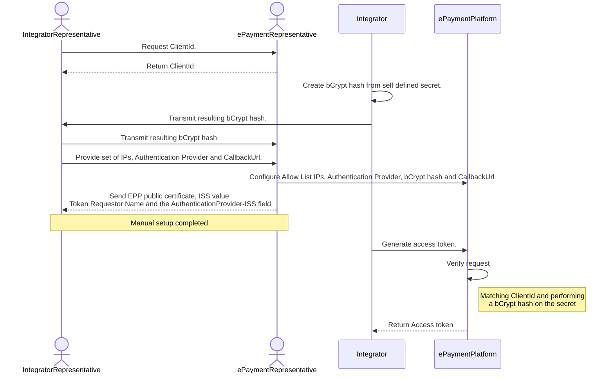

<p align="center">

</p>

```
Welcome to the Getting Started guide for the BankAxept 
Epayment Platform (EPP).

This text is intended to give both clear descriptions and 
guidance for integrators and consumers of EPP. It includes an
overview of all critical features as well as some general
hints of how to utilize this platform.
```

# Introduction
EPaymentPlatform (EPP) is a Payment API for integrators (Integrator) utilizing BankAxept online payments. 
It is based on a core principle of asynchronous exchange of information where the transactions created can be identified using an EPP defined `PaymentId` and an Integrator defined `MessageId`. 
Subsequent transaction operations (Capture, Refund etc.) can thereafter be performed as seen according to the `Operations` section.

## Setting up your EPP integration

In order to set up your EPP integration and start requesting payments, the following operations need to 
be performed.

1. Through your BankAxept contact point you should retrieve your unique identifier (ClientId) as an integrator.
2. Provide a list of IPs that you will be operating from, enabling us to append them to our Allow List. Any additional IPs need to be transmitted to the BankAxept ePayment team contact before being utilized.
3. Provide a `callBackURL` which we will utilize as our address prefix for all callbacks.
4. Provide the certified Authentication Provider which you  will use to Authenticate payments. 
5. Create a bCrypt based hash of a secret of your choice. We recommend reading up on [bCrypt](https://en.wikipedia.org/wiki/Bcrypt#) to understand the mechanisms involved. 
6. Send the resulting IPs, CallbackUrl and bCrypt hash to your BankAxept ePayment team contact. 
7. Receive EPP's Public Certificate for encryption of sensitive data.
8. Generate an access token as described in the [Authorization](#authorization) section 
9. Utilize the access token to perform payments as described in the [Creating a Payment](#creating-a-payment) section

## Authorization

Once the set-up steps are performed you can then integrate with the [Client Authorization Service](assets/swagger/swagger_integrator_accesstoken_bankaxept.mdl).
The request should contain the secret used to generate the bCrypt based hash as well as your ClientId. This should be sent as a [Basic token](https://en.wikipedia.org/wiki/Basic_access_authentication)
The resulting access token has a 1-hour lifetime. We recommend refreshing it 5 minutes before end of life. The resulting `access_token` can then be used to authorize
towards all other endpoints by putting it in the `Authorization` header as Bearer token.

### bCrypt guidelines

We recommend using Spring for up to date bCrypt generation. 
For example the following command will result in a satisfactory bCrypt hash.

```
# brew tap spring-io/tap && brew install spring-boot
spring encodepassword -a bcrypt <secret> 
```

### Authentication provider and Wallet provider flow and interoperation

Please see our [Authentication Provider setup and guidelines](/authentication_interoperability) 

## End to end setup of profile diagram



### Checklist for information exchange

| Information item(s)      | Description                                                                                                                                   |
|--------------------------|-----------------------------------------------------------------------------------------------------------------------------------------------|
| ClientId                 | Generated by the ePayment Platform and returned to Integrator                                                                                 |
| CallbackUrl              | Defined by Integrator, will be the prefix address all Callback requests are sent. Peruse our [Callback](#callbacks) section for more context. |
| ClientSecret             | A bCrypt secret that is **kept secret at the Integrator** and used to generate access tokens.                                                 |
| ClientSecret bCrypt Hash | A bCrypt secret hash that is sent to the ePaymentPlatform and configured to the Integrators clientID                                          |
| Authentication Provider  | Inform the EPP team which Authentication Provider you will be utilizing                                                                       |
| ISS                      | Once the your profile is set up your will receive the Issuer ID corresponding to the your Integrator or Authentication Provider profile.      |
| EPP public key           | Is sent by EPP during setup, needed to encrypt parts of requests.                                                                             |
| Token Requestor Name     | Is sent by EPP during setup, needs to be part of enrolment requests.                                                                          |

## Integration guidelines

This section contains general guidelines for integrating with the EPP.

### Context ID 
All requests support an `X-Correlation-Id` header which can be used to correlate requests and responses. This is especially useful if you always ensure to set this header to a unique value for each request.
The `X-Correlation-Id` is returned in the corresponding callback, allowing you an additional mechanism to correlate the callback with the original request. It is **required** to use this header for enabling traceability and support. 

### MessageId
The system acts idempotent on any `messageId`. It is **required** that you use a robust UUID generator (or similar mechanism) to ensure that each request has a unique `messageId`. 

#### MessageId uniqueness & Callbacks
EPP creates a UUID that is used as a `messageId` for each callback that is used to distinguish between different requests. This `messageId` is considered to be part of the message exchange between EEP and the Integrator.
This means that you should not re-use this `messageId` for any other requests.

### Asynchronous retry policy
Any Asynchronous Requests will be retried if the Response from the Integrator is anything other than `2xx` or `4xx`. In the case of a `4xx` the response will be interpreted as a final state and not retried.

Retries will be performed first after 10 seconds, and thereafter with an exponential backoff for 24 hours. After 24 hours the retry attempts will stop.

The backoff will extend additionally at a rate of `1.5^X` seconds where X is the number of retries until a max retry interval of `10 minutes` is reached.

## API Lifecycle

We strive to keep our API backwards compatible in order to minimize the impact on our integrators. 
The following changes are considered backwards compatible.

### Expanding a request with an optional field.

As long as a field is optional it is considered backwards compatible to add it to a request. This means that the integrator can choose to ignore the field if it is not needed.
This should be unproblematic, but bear this constraint in mind regarding any automation and validation tied to our Swagger files.

### Expanding a response with an optional field.

As long as a field is optional it is considered backwards compatible to add it to a response. This means that the integrator can choose to ignore the field if it is not needed.
This should be unproblematic, but bear this constraint in mind regarding any automation and validation tied to our Swagger files. As well as overly strict response deserialization.

`Response parsing must be robust and ignore any unknown fields.`

### Relaxing validation rules
For example making the required length of a string shorter. This is considered backwards compatible as long as the integrator can still send the same data as before.

### Correcting bugs/errors that does not change intended behavior.

Correcting a bug, for example an incorrect/malformed error returned in an edge case, is considered backwards compatible as long as the integrator can still send the same data as before.
