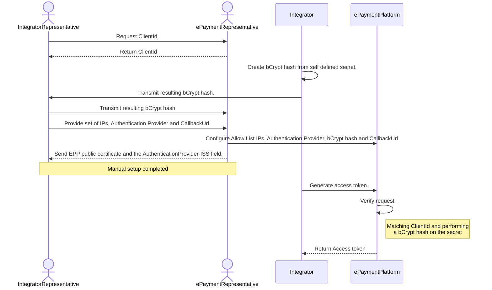
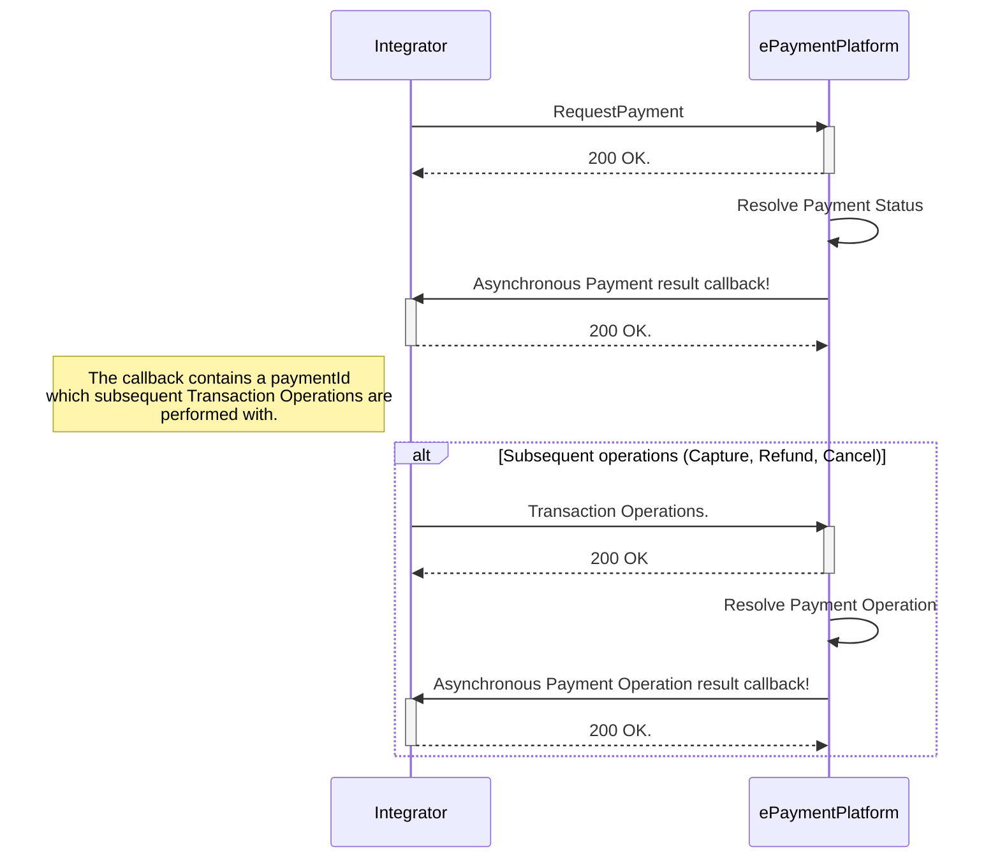

<p align="center">

</p>

```
Welcome to the Getting Started guide for the BankAxept 
Epayment Platform (EPP).

This text is intended to give both clear descriptions and 
guidance for integrators and consumers of EPP. It includes an
overview of all critical features as well as some general
hints of how to utilize this platform.
```

<!-- TOC -->

* [Introduction](#introduction)
* [Setting up your EPP integration](#setting-up-your-epp-integration)
  * [Authorization](#authorization)
  * [End to end setup diagram.](#end-to-end-setup-diagram)
    * [Checklist for information exchange](#checklist-for-information-exchange)
* [Creating a payment](#creating-a-payment)
  * [Standard flow](#standard-flow)
  * [Creating a payment guidelines.](#creating-a-payment-guidelines)
  * [Callbacks](#callbacks)
    * [Payment Callbacks](#payment-callbacks)
    * [Asynchronous retry policy](#asynchronous-retry-policy)
<!-- TOC -->

# Introduction
EPaymentPlatform (EPP) is a Payment API for integrators (Integrator) utilizing BankAxept online payments. It is based on a core principle of asynchronous exchange of information where the transactions created can be identified using an EPP defined PaymentId and an Integrator defined MessageId. Traditional transaction operations can thereafter be performed as seen according to the `Operations` section.

## Setting up your EPP integration

In order to set up your EPP integration and start requesting payments the following operations need to 
be performed.

1. Through your BankAxept contact point you should retrieve a unique identifier (ClientId) that uniquely identifies you as an integrator.
2. Provide a list of IPs that you will be operating from, enabling us to append them to our Allow List. Any additional IPs need to be transmitted to the BankAxept ePayment team contact before being utilized.
3. Provide a `callBackURL` which we will utilize as our address prefix for all callbacks.
4. Provide the certified Authentication Provider which you  will use to Authenticate payments. 
5. Create a bCrypt based hash of a secret of your choice. We recommend reading up on [bCrypt](https://en.wikipedia.org/wiki/Bcrypt#) to understand the mechanisms involved. 
6. Send the resulting IPs, CallbackUrl and bCrypt hash to your BankAxept ePayment team contact. 
7. Receive EPP's Public Certificate for encryption of sensitive data.
8. Generate an access token as described in the [Authorization](#authorization) section 
9. Utilize the access token to perform payments as described in the [Creating a Payment](#creating-a-payment) section

## Authorization

Once the set-up steps are performed you can then integrate with the [Client Authorization Service](https://github.com/BankAxept/bankaxept-epayment-development-kit/blob/main/openapi/access-token/bankaxept.yaml).
The request should contain the secret used to generate the bCrypt based hash as well as you're ClientId. This should be sent as a [Basic token](https://en.wikipedia.org/wiki/Basic_access_authentication)
The resulting access token has a 1-hour lifetime. We recommend refreshing it 5 minutes before end of life. The resulting `access_token` can then be used to authorize
towards all other endpoints by putting it in the `Authorization` header as Bearer token.

### Authentication provider and Wallet provider flow and interoperation.

Please see our [Authentication Provider setup and guidelines](/authentication_interoperability) 

## End to end setup of profile diagram.



### Checklist for information exchange

| Information item(s)      | Description                                                                                                                                   |
|--------------------------|-----------------------------------------------------------------------------------------------------------------------------------------------|
| ClientId                 | Generated by the ePayment Platform and returned to Integrator                                                                                 |
| CallbackUrl              | Defined by Integrator, will be the prefix address all Callback requests are sent. Peruse our [Callback](#callbacks) section for more context. |
| ClientSecret             | A bCrypt secret that is **kept secret at the Integrator** and used to generate access tokens.                                                 |
| ClientSecret bCrypt Hash | A bCrypt secret hash that is sent to the ePaymentPlatform and configured to the Integrators clientID                                          |
| Authentication Provider  | Inform the EPP team which Authentication Provider you will be utilizing                                                                       |
| ISS                      | Once the your profile is set up your will receive the Issuer ID corresponding to the your Integrator or Authentication Provider profile.      |
| EPP public key           | Is sent by EPP during setup, needed to encrypt parts of requests.                                                                             |
| Token Requestor Name     | Is sent by EPP during setup, needs to be part of enrollment requests..                                                                        |

# Creating a payment
A full overview of all available fields for a payment can be found in the [Payments Request](https://github.com/BankAxept/bankaxept-epayment-development-kit/blob/main/openapi/integrator/merchant/bankaxept.yaml) component part our API spec.

## Standard flow

Below is the Payment request's happy flow. Note that the PaymentId which
subsequent operations are performed with is contained in the asynchronous callback.




## Creating a payment guidelines.

``messageId``: The ``messageId``field is considered the Integrator's unique identifier of a PaymentRequest, and can be used in the case of a [Rollback Request](https://github.com/BankAxept/bankaxept-epayment-development-kit/blob/main/openapi/integrator/merchant/bankaxept.yaml)
of an ongoing payment. The ePaymentPlatform performs duplicate controls on the ``messageId`` field, and acts idempotent on requests with the same ``messageId``. Therefore, it *must* be unique pr separate payment request. Meaning that if multiple are done for the same Order (for example a retry due to a previously failed payment request.), a new ``messageId`` must be used.

``merchantOrderReference``: The ``merchantOrderReference``field is considered a reference to the Merchant's Order which might be distinct from the Integrator's own ``messageId``.

## Callbacks

### Payment Callbacks
The required Callback API for an ePayment Platform Payment may be found [in the Partner Yaml](https://github.com/BankAxept/bankaxept-epayment-development-kit/blob/main/openapi/integrator/merchant/partner.yaml) definition.

### Asynchronous retry policy
Any Asynchronous Requests will be retried if the Response from the Integrator is anything other than ``200 OK``.

Retries will be performed first after 10 seconds, and thereafter with an exponential backoff for 24 hours. After 24 hours the retry attempts will stop.

The backoff will extend additionally at a rate of `1.5^X` seconds where X is the number of retries until a max retry interval of `10 minutes` is reached.
