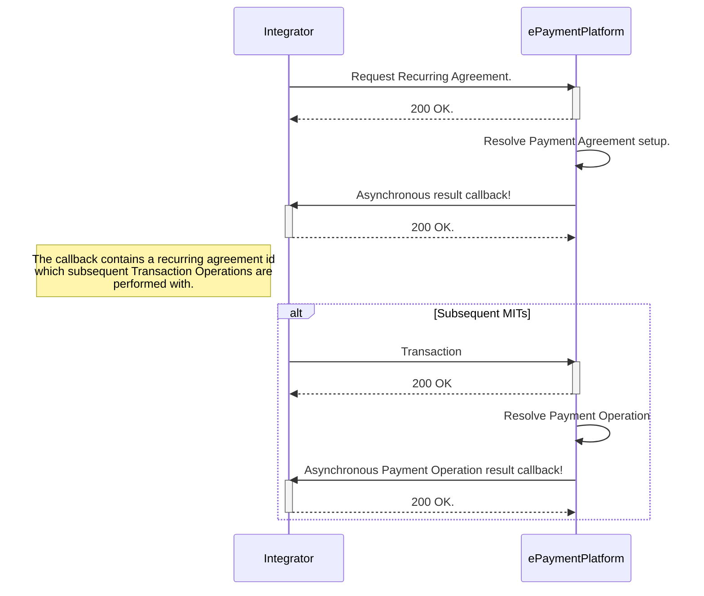

# Recurring Payments

BankAxept ePayment supports recurring payments. This allows a merchant to charge a payment agreement on either a fixed
or an unfixed schedule.

## Core Concepts And Terminology

| Concept             | Description                                                                                                                                             |
|---------------------|---------------------------------------------------------------------------------------------------------------------------------------------------------|
| CIT                 | Customer Initiated Transaction. A transaction initiated by the customer, where the customer is present and actively involved.                           |
| MIT                 | Merchant Initiated Transaction. A transaction initiated by the merchant, where the customer is not present and does not actively participate.           |
| Recurring Agreement | An agreement between the customer and the merchant that allows the merchant to charge future transactions without requiring the customer to be present. |

Recurring payments are supported by setting up a Payment Agreement representation in the ePayment system.

The recurring payment must be set up with the customer's consent, and the customer must be informed about the details of
the agreement.
This must then be approved by a DSCA operation and added to the payment agreement request in the same manner as in a
normal payment request.

Subsequent transactions may then be performed without the customer being present, as long as the transaction is in
accordance with the agreement. The control of the correspondence between the transaction and the agreement is the
responsibility of the merchant.

## Recurring Agreements

The Recurring Agreements primary definition is from "type" value.
Currently only "UNCOF" is supported, with future support for "Support" and "Instalment" being planned.

Note that a recurring agreement may include a payment component, or it might be set up with a zero amount payment.
In either case a verification of the payment source will be performed at the moment of the agreement setup by the
ePayment system.
If the payment source is not valid, the agreement will not be set up, and the merchant will receive a response with an
error code.

The following example shows metadata that can be provided for a recurring agreement:

```json
{
  "interval": {
    "unit": "DAY",
    "count": 31
  },
  "count": 999
}
```

These are optional and is for informational purposes only. The interval is the time between each transaction, and the
count is
the number of transactions that will be performed. The merchant is responsible for ensuring that the transactions are
performed in accordance with the agreement, and that the customer is informed about the details of the agreement.

### Termination of Recurring Agreements

Once a recurring agreement is terminated a DELETE request should be sent to the payment agreement endpoint, and the
agreement will be removed from the system.

## Merchant Initiated Transactions (MITs)

MITs are server to server requests with no requirement for the customer to be present.
They are processsed as normal payment requests, but with the addition of a payment agreement reference.
In addition there are no requirements for a DSCA component, as the customer has already approved the agreement.

## Flow


